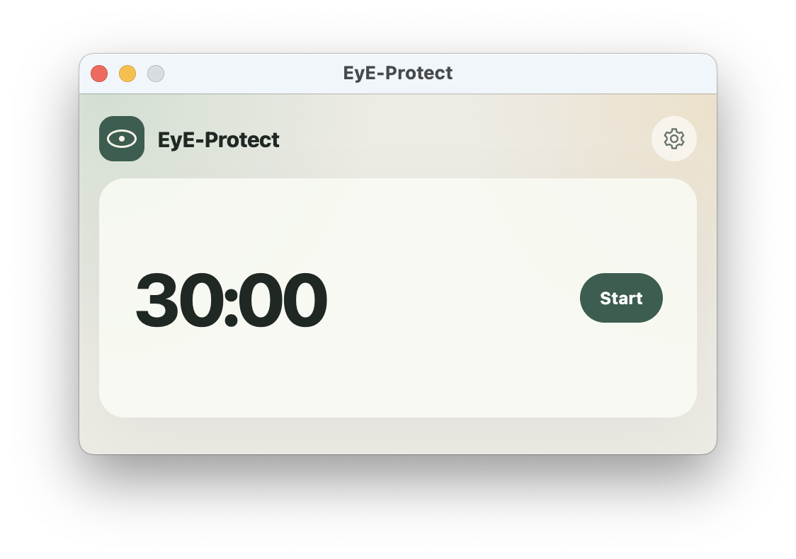
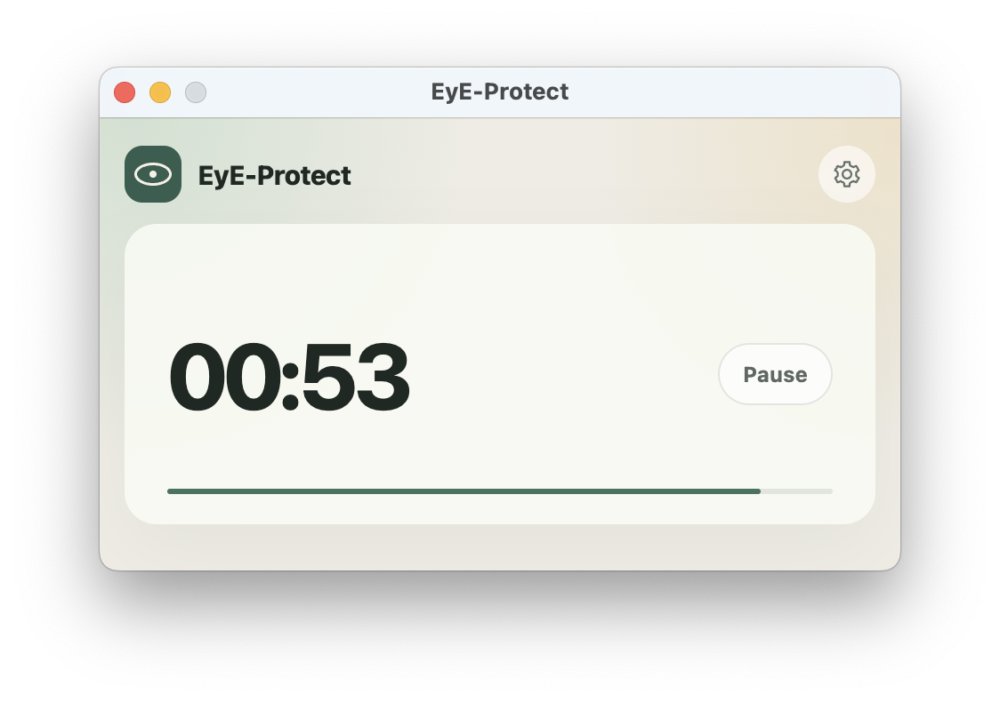
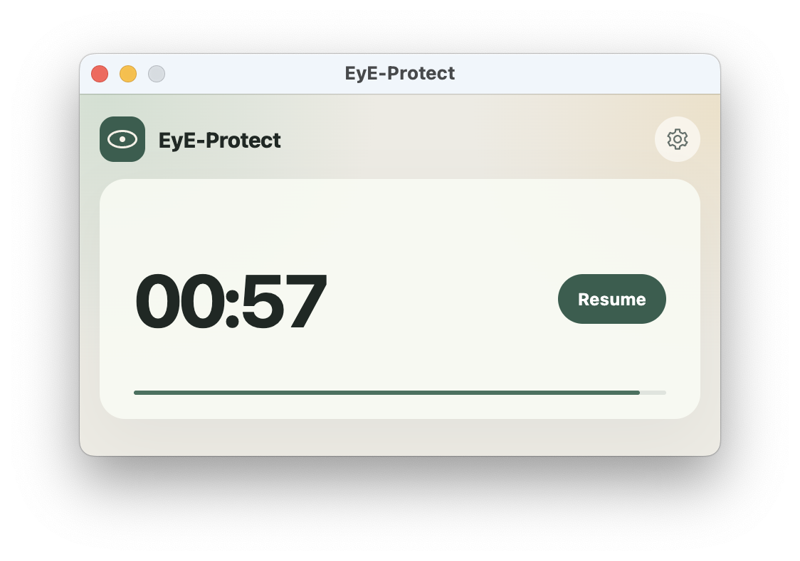
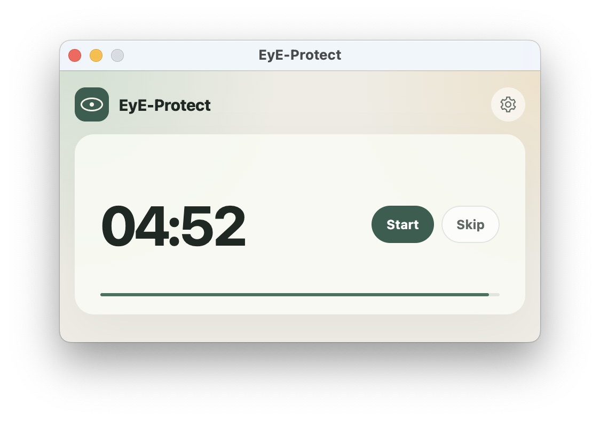
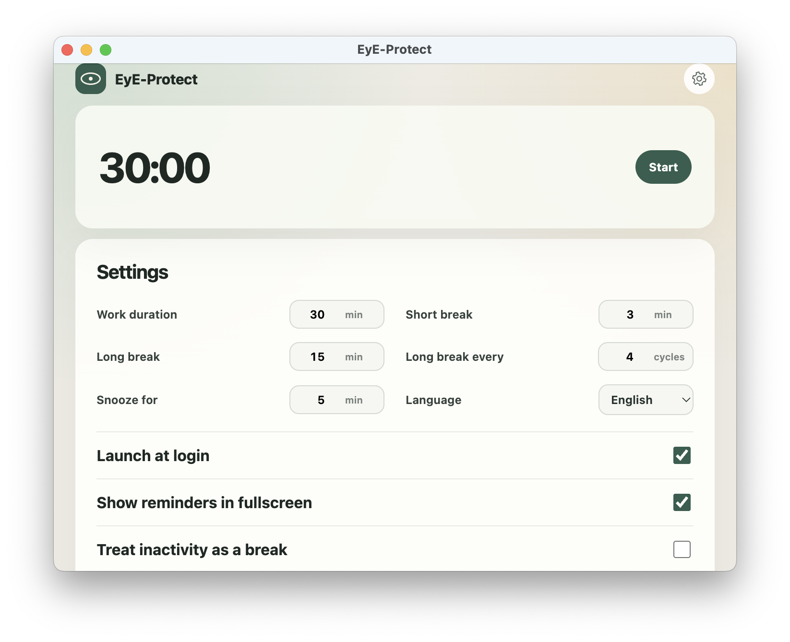
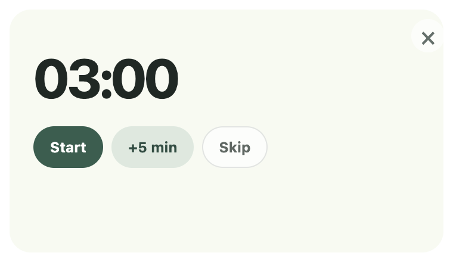
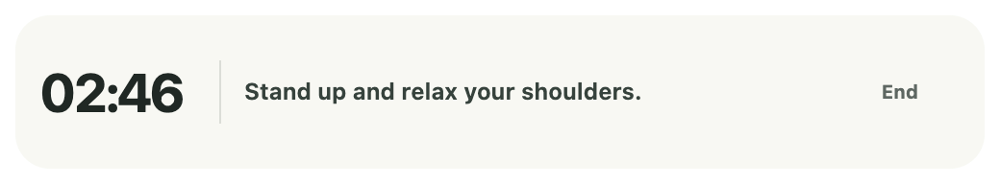
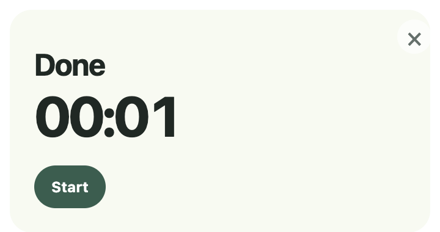

# EyE-Protect

在我最近去验光时，惊恐地发现我的眼睛很坏——过了两年提升了 100+ 度。

我决定有意识地照顾自己的眼睛，于是我与 Codex 开发了这款轻量级的 Electron 应用。

它的作用是，在你使用电脑一定时间（default: 30min）后，温和地提醒你站起来眺望远方，休息几分钟。

## Screenshots

### Timer states

| Ready | Running |
| :---: | :---: |
|  |  |
| Paused | Break due |
|  |  |

### Settings

<p align="center">
  
</p>

### Break reminder

| Break due | Break in progress | Break complete |
| :---: | :---: | :---: |
|  |  |  |

## Development

Requirements:

- Node.js 22 or newer
- npm

Install and run:

```bash
npm install
npm start
```

Run tests:

```bash
npm test
```

Create an unpacked application:

```bash
npm run pack
```

Create platform installers on the corresponding operating system:

```bash
npm run dist:mac
npm run dist:win
```

Unsigned development builds may trigger operating-system security warnings. Public releases should be code-signed and notarized before distribution.

## Privacy

EyE-Protect does not send network requests at runtime. Preferences are written to Electron's per-user application data directory and are never committed to this repository. See [PRIVACY.md](PRIVACY.md) for details.

## License

MIT. See [LICENSE](LICENSE).
